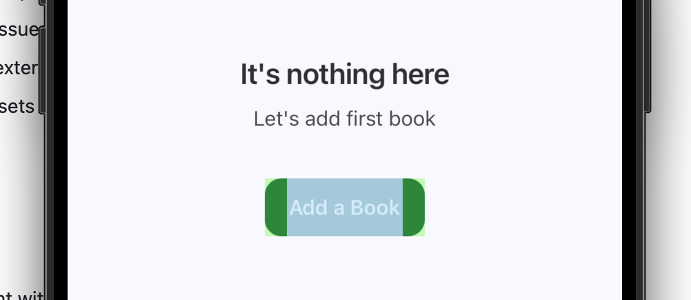
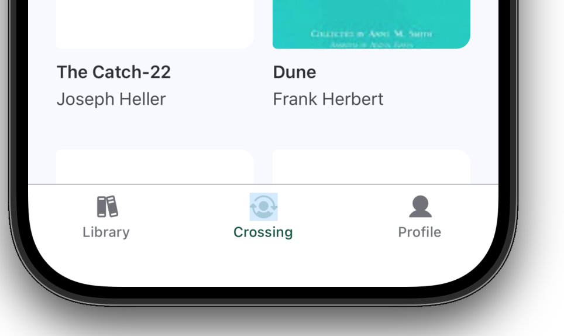
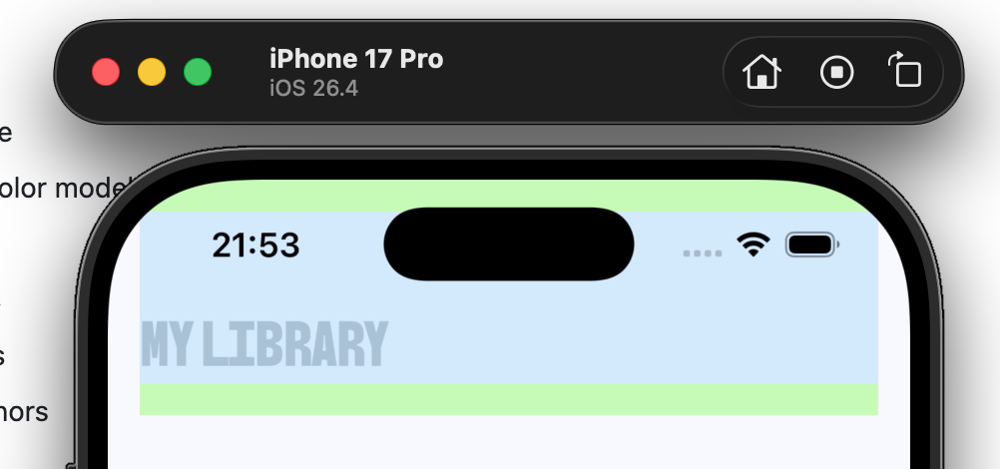
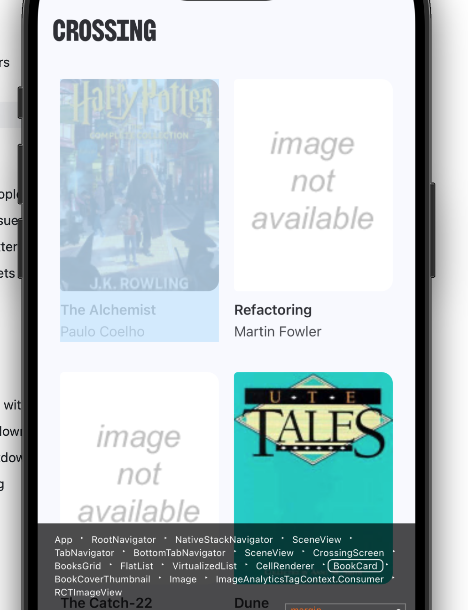
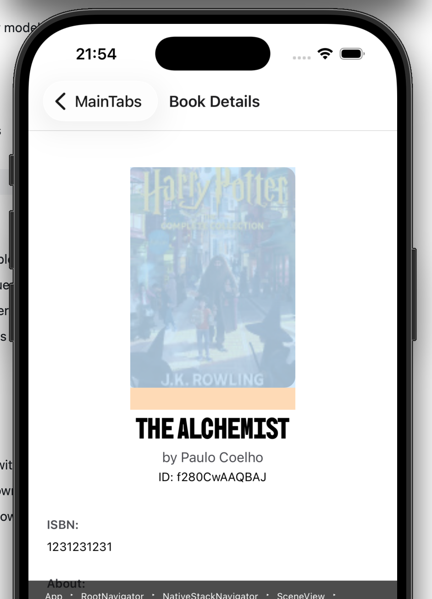
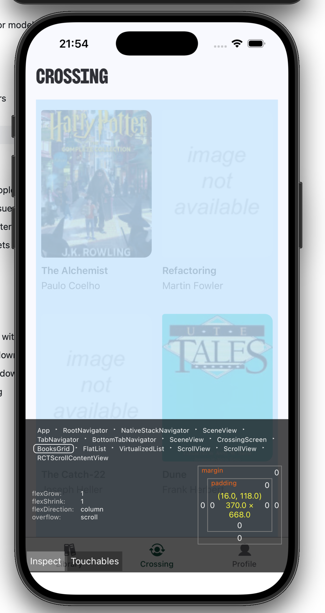
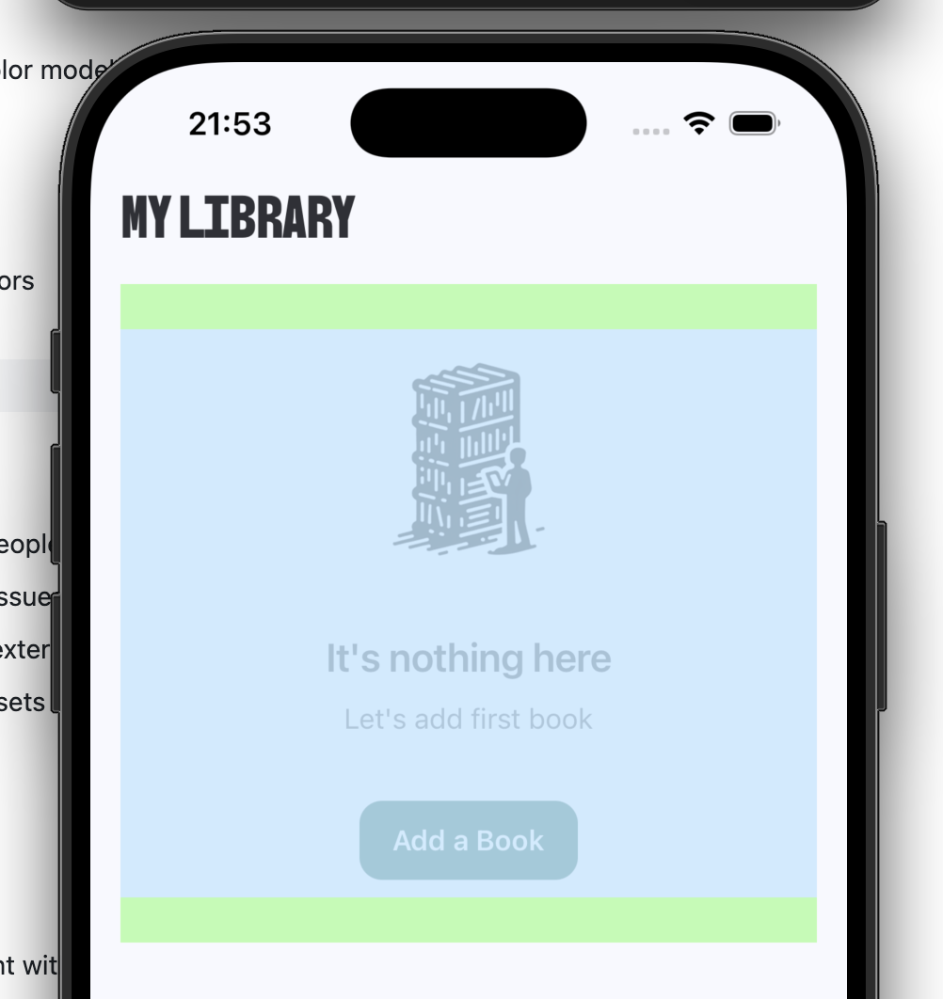

# Tasks 2 [cross_assignment_2]

## Components List

1. Button.
2. Icon.
3. Header.
4. BookCard.
5. BookCoverThumbnail.
6. BooksGrid.
7. Empty State.

## Components Screenshot

### 1. Button [tsx](../../src/components/Button/Button.tsx)

Default button component with four different variants and two sizes (large, medium)

### 2. Icon [tsx](../../src/components/Icon/Icon.tsx)

Default icon component that accept maped svg icons from internal set.

### 3. Header [tsx](../../src/components/Header/Header.tsx)

Main screens Header component which can accept suffix elements.

### 4. BookCard [tsx](../../src/components/BookCard/BookCard.tsx)

Main book item card, that contains of BookCoverThubmnail, Title, Author.

### 5. BookCoverThumbnail [tsx](../../src/components/BookCoverThumbnail/BookCoverThumbnail.tsx)

Main thumbnail with a cover of the book.

### 6. BooksGrid [tsx](../../src/components/BooksGrid/BooksGrid.tsx)

Main grid of books used across the app.

### 7. Empty State [tsx](../../src/components/EmptyState/EmptyState.tsx)

Customizable empty state which cosists of illustration (optional), title, subtitle and button (optional).

