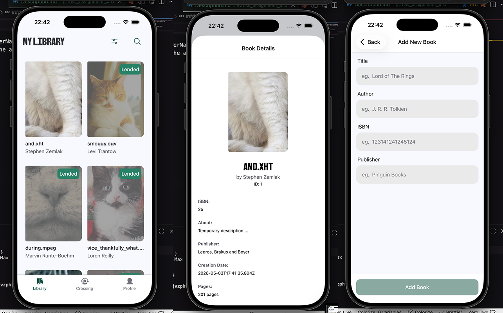
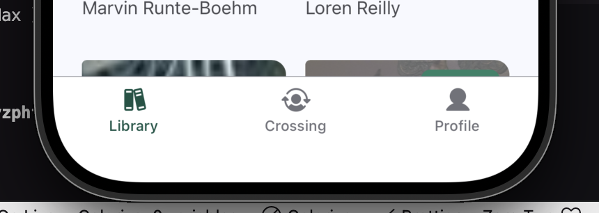
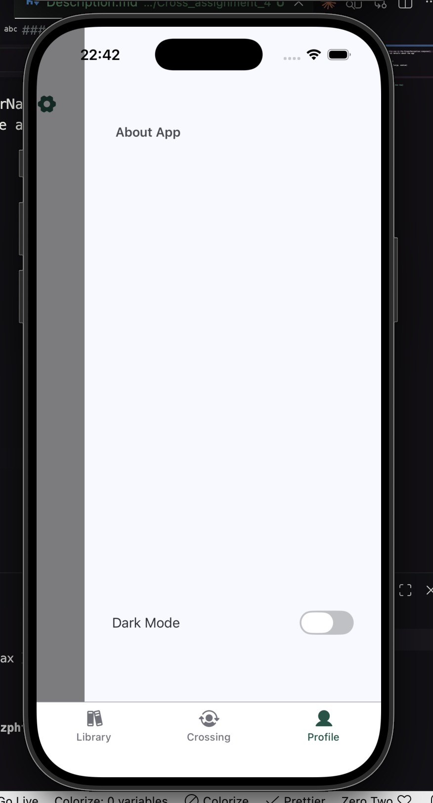

# Tasks 4 [cross_assignment_4]

## Navigations

1. Stack. Contains Tabs, BookDetailsPage and AddBookPage.
2. Tab. Contains 3 tabs "Library", "Crossing" and "Profile". Profile one is the DrawerNavigation component.
3. Drawer. Accessible only from Tab "Profile" and contains technical details about the app

## Screenshots

### 1. Stack Navigation [tsx](../../src/navigation/RootNavigator.tsx)

Contains Tabs, BookDetailsPage and AddBookPage.

### 2. Tab Navigation [tsx](../../src/navigation/TabNavigator.tsx)

Contains 3 tabs "Library", "Crossing" and "Profile". Profile one is the DrawerNavigation component.

### 3. Drawer Navigation [tsx](../../src/navigation/ProfileDrawerNavigator.tsx)

Accessible only from Tab "Profile" and contains technical details about the app

