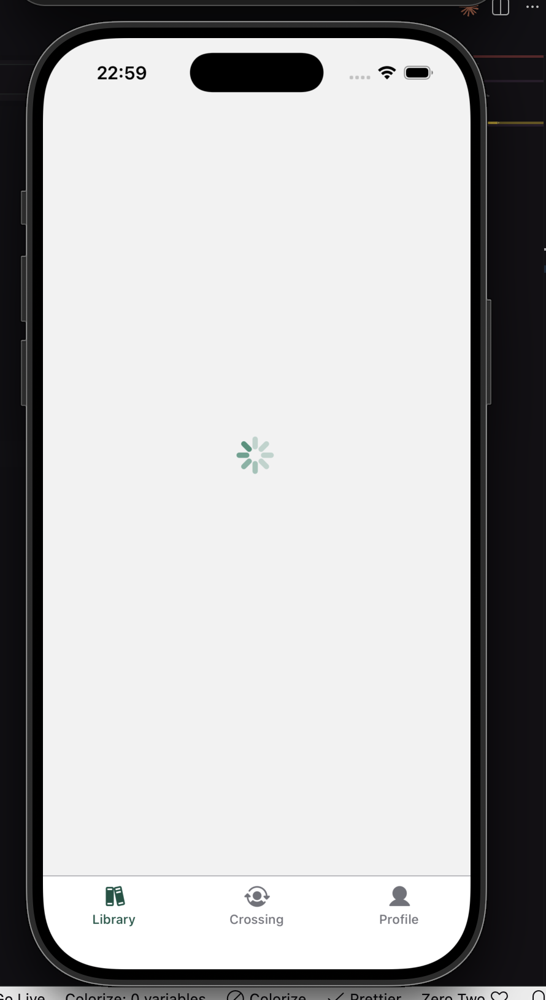
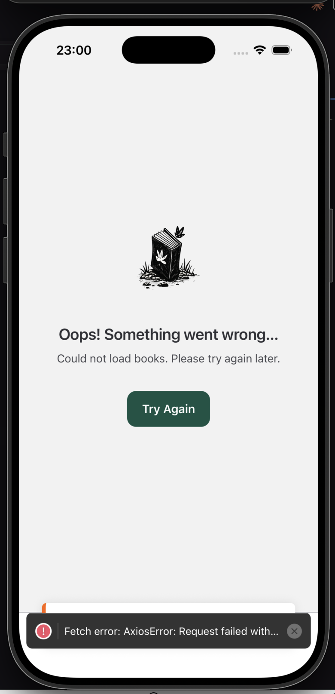
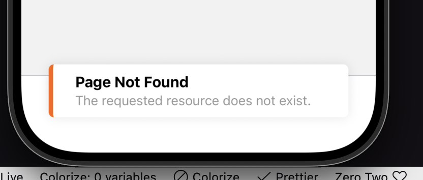

# Tasks 5 [cross_assignment_5]

## API

1. I'm using MockAPI as a resource for test data. It generates Book objects with: id, author, title, publisher, year, coverImage, booking status, isbn, created at.
2. Using Axios to make requests to the MockAPI.
3. Using axios interceptor to catch server based errors, which are rendered across the app using <Toast> component.
4. On HomeScreen and CrossingScreen added additional ErrorState which appears if there is rejected promise.
5. Added activity indicator while waiting for the response.

## API Docs

1. Client – [View ts](../../src/api/client.ts)
2. bookService – [View ts](../../src/api/bookService.ts)
3. Hook: useBooks – [View ts](../../src/hooks/useBooks.ts)

## Screenshots

### 1. Activity Indicator

### 2. ErrorState

### 2. Toast with Error Message

